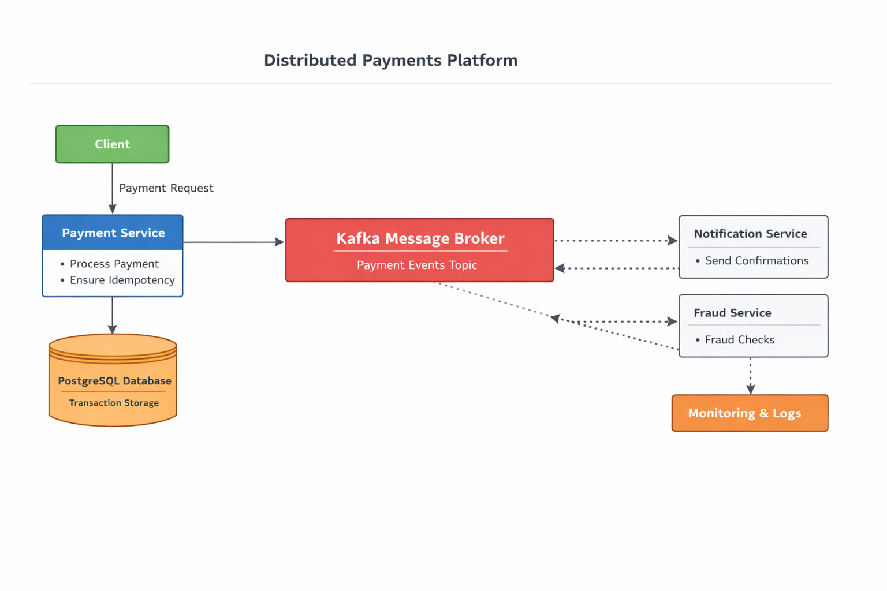

## 💳 Distributed Payments Platform

This project simulates a real-world event-driven payment processing system designed to handle transactions reliably in a distributed microservices environment.

It focuses on:
- asynchronous processing using Kafka
- idempotent payment handling
- fault tolerance and retry mechanisms
- scalable backend architecture

## 🧠 Architecture

The system follows an event-driven microservices architecture:

1. Client sends payment request
2. Payment Service processes request
3. Event is published to Kafka
4. Other services consume events asynchronously
5. Database stores transaction state

## 📊 Architecture Diagram

The diagram below shows how payment requests move through the platform using Kafka-based asynchronous communication.

## Request Flow

1. Client sends a payment request to the Payment Service.
2. Payment Service validates the request and enforces idempotency.
3. Transaction data is stored in PostgreSQL.
4. A payment event is published to Kafka.
5. Downstream services such as Notification or Fraud consume the event asynchronously.
6. Monitoring and logs capture system activity and failures.

## 🔥 Key Engineering Concepts

- Idempotency to prevent duplicate payments
- Retry mechanism for failed transactions
- Event-driven communication using Kafka
- Separation of concerns via microservices
- Eventual consistency in distributed systems

## 📡 API Endpoints

POST /payments  
GET /payments/{id}

## 🧠 Learnings

- Designing distributed systems using event-driven architecture
- Handling failures in asynchronous systems
- Structuring scalable Spring Boot applications
- Understanding real-world payment system challenges
